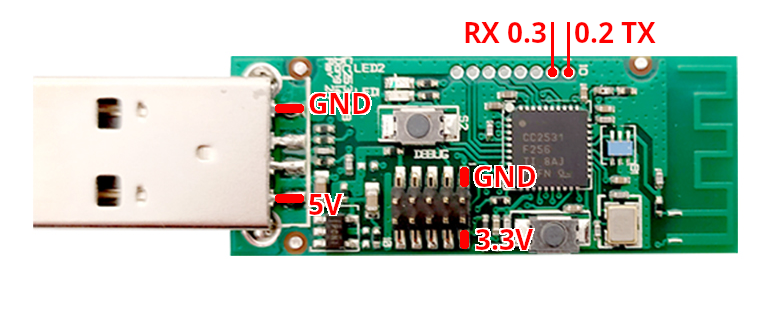
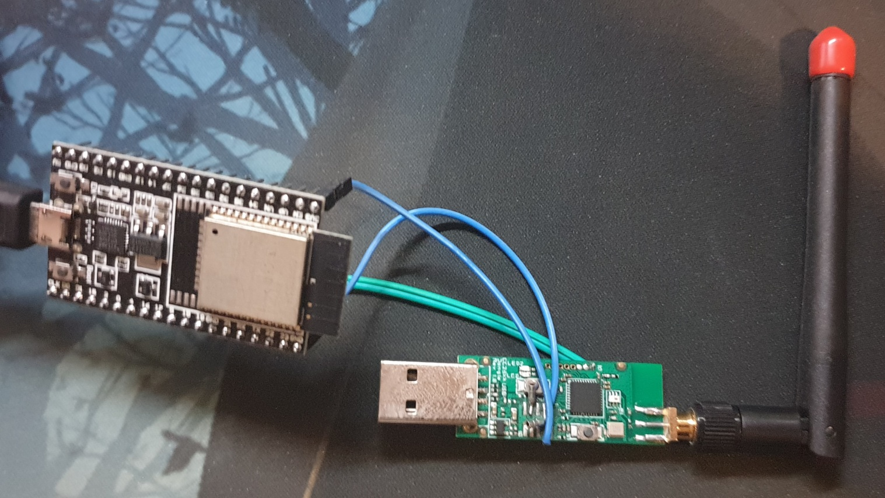

### ESPhome configs

# ESP32 BLE+Zigbee bridge
I flashed a CC2531 dongle with a CC2530 firmware [from here](https://github.com/Koenkk/Z-Stack-firmware/tree/master/coordinator). Can't remember which one, but probably the [Z-Stack_Home_1.2 Default](https://github.com/Koenkk/Z-Stack-firmware/blob/master/coordinator/Z-Stack_Home_1.2/bin/default/CC2530_DEFAULT_20201127.zip).  
Should you want to replicate this, please get a CC2530 with properly broken out pins since the pins on the side of the CC2531 USB dongle are incredibly small, or a CC2530 + CC2591/CC2592 that would probably be an even better choice for range; that said, those are old devices and can only run Zigbee 1.2 firmware properly, you *can* flash a 3.0 firmware but you'll probably encounter some issues.  
Honestly, if you have the budget, just get a ConBee or a RaspBee if you want that sweet sweet deCONZ, or a zzh! or a CC2652R/P/RB stick if you prefer ZHA or zigbee2mqtt. Apparently, Silicon Labs's EZSP v8 modules (EFR32MG21) are very good too, and the CC1352P works too.  

However, if you already have a CC2531 dongle, after flashing it with the CC2530 firmware, solder two wires on the IO connector, on the 0.2 and 0.3 pins, and other two on the GND and VCC (3.3V) headers (maybe you'll have more success if you remove them and use the pads). You could also solder on the USB pins and use 5V instead if you feel like it, but I prefer not to mess with the USB port.  

  

I only made this hub to keep my RasPi's USB ports free (especially since the Pi 3's USB cripple the ethernet port, even though the dongle doesn't transmit enough data for it to be a problem). Maybe I'll evolve this into a "superhub" with BLE, Zigbee, Matter, Z-Wave, and even 433MHz, all in a single PCB with no ugly wires, but it's not gonna happen any time soon. Feel free to [donate on my Ko-Fi](https://ko-fi.com/exentio) if you want me to work on that.  

  

Huge thank you to Oxan for his stream server library! [oxan/esphome-stream-server](https://github.com/oxan/esphome-stream-server)